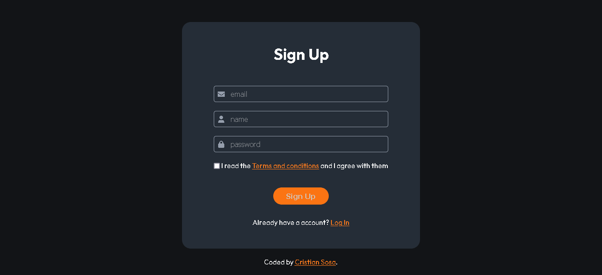

# Practice - Form Sign Up

## Hello! 👋 GitHub community

Thanks for checking out this practice. This time I try to practice with the 'placeholder selectors' of SASS.

## The challenge

I want to create a form component, the inputs have  to use a placeholder selector.

To do it, I used HTML5 and SASS

If someone wants to give me some advice, they are welcome